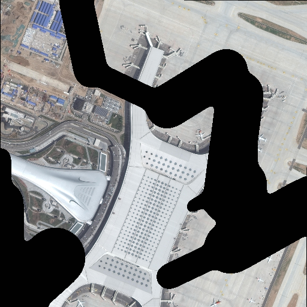
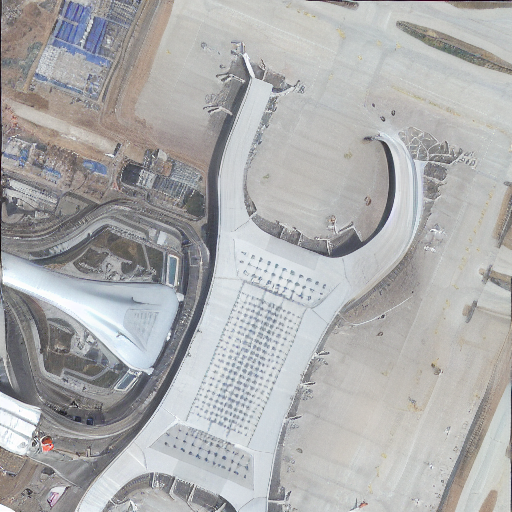

参考了 **[T2I-Adapter: Learning Adapters to Dig out More Controllable Ability for Text-to-Image Diffusion Models](https://arxiv.org/abs/2302.08453)**  
在**https://github.com/TencentARC/T2I-Adapter/tree/SD**基础上实现了Inpainting Adapter的训练。
参考**https://github.com/advimman/lama**
## 生成随机mask
```shell
python Lama_mask/gen_mask_dataset.py Lama_mask/configs/data_gen/random_medium_512.yaml [/path/to/dataset/dir] [outdir] --n-jobs 1 --ext png
```
## 训练

```shell
export RANK=0 WORLD_SIZE=1 MASTER_ADDR="127.0.0.1" MASTER_PORT=1234
python train_inpaint.py --ckpt [path_to_sdckpt] \
            --gpus "[0]"\
            --name inpaint_v1\
            --auto_resume \
            --num_workers 0
```
## 测试
```shell
python test_inpaint.py \
--cond_path [path_to_origin] \
--mask [path_to_mask] \
--prompt "" \
--sd_ckpt [path_to_sdckpt] \
--resize_short_edge 512 --cond_tau 1.0 --cond_weight 1.0 --n_samples 2 \
--adapter_ckpt ./experiments/inpaintv1/[xxxx].pth \
--scale 9 \
--seed 42
```
## 其他说明
对于遥感图像而言，在batchsize为16的情况下，需要大概7000steps的训练
遥感图像的inpainting,基础效果如下： 
  



